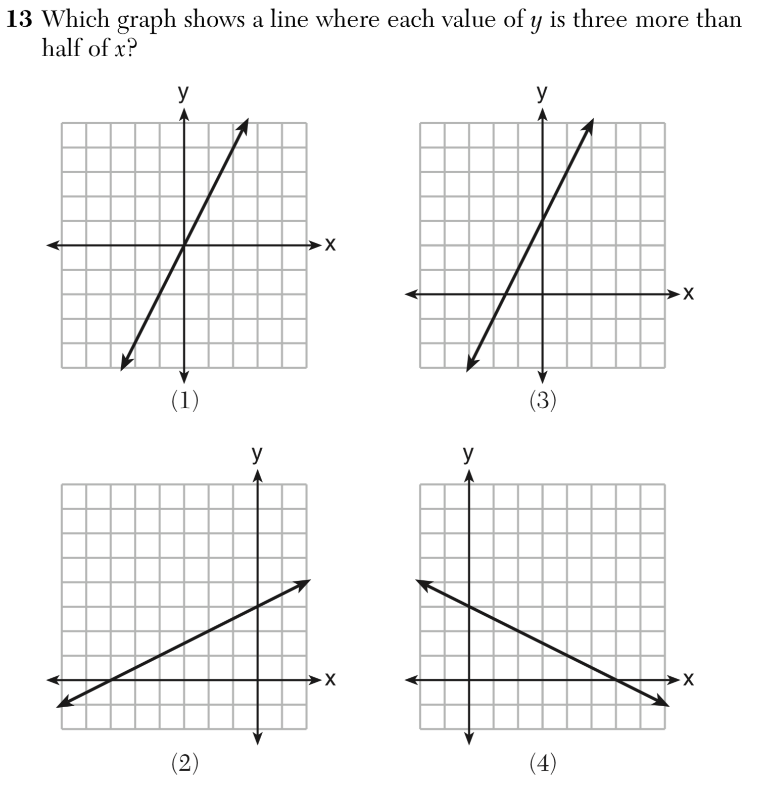

```{r setup, include = FALSE}
source("functions.R")
library(papaja)
library(knitr)
library(Hmisc)
library(afex)
library(ggbeeswarm)
library(flextable)
library(patchwork)
library(broom)
library(scales)
library(tidyverse)
library(glue)
library(ordinal)
library(beepr)
library(parallel)
opts_chunk$set(
  echo = FALSE,
  warning = FALSE,
  cache = TRUE,
  dev = c("png", "pdf"),
  fig.ext = c("png", "pdf"),
  fig.retina = 2
)
options(mc.cores = parallel::detectCores())
theme_set(
  theme_linedraw(base_size = 8) + 
    theme(panel.grid = element_blank(), legend.position = "right")
)
# Function to format p values
pvalue <- function(x) {
  out <- scales::pvalue(x, add_p = T)
  out <- str_replace(out, "<", " < ")
  out <- str_replace(out, "=", " = ")
  out
}
```

# Introduction

To successfully improve learning, it is important that people are able to monitor what they know and what they don't know [@BjorkMemoryMetamemoryConsiderations1994; @FlavellMetacognitioncognitivemonitoring1979; @MetcalfeMetacognitiveJudgmentsControl2009; @NelsonMetamemoryTheoreticalFramework1990; @NelsonUtilizationMetacognitiveJudgments1994]. This metacognitive monitoring and knowledge, when accurate, may be used to select appropriate items for further study or to seek assistance to improve comprehension. To paraphrase the oft-quoted adage: If you don't know what you don't know, you can't fix it. It is therefore of paramount importance that people be metacognitively accurate in all fields of study. 

The relative accuracy, or *resolution*, of metacognitive judgments measures the extent to which people can discriminate whether they answered (or will answer) a particular question accurately, on an item-by-item basis. A strong positive relation between a participant's ratings about how sure they are that they are, or will be, correct on particular items and their actual correctness on those items indicates good resolution. Broadly, research has focused on two types of metacognitive ratings: Prospective ratings, such as judgments of learning (JOL), feelings of knowing (FOK) or ease of learning judgments (EOL), indicate how likely the participant thinks that a later retrieval or answer will be correct. Retrospective ratings indicate the participant's judgment of the accuracy of a just-provided answer, typically in the form of judgments of confidence. Although these judgments are distinct, for clarity we refer to all as judgments of confidence (in the accuracy of one's answer). Typically, the correspondence between confidence and accuracy is referred to as metacognitive resolution, relative accuracy [@DunloskyMetacognition2009], or sensitivity [@FlemingHowmeasuremetacognition2014].

Another aspect of metacognitive accuracy, sometimes termed calibration, absolute accuracy, bias, or over/underconfidence, concerns the relationship between participants' average level of performance and average metacognitive judgment magnitude [@DunloskyMetacognition2009; @Lichtensteinthosewhoknow1977]. For example, it has been found that individuals with poorer performance in a task tend to overestimate their task abilities, a phenomenon known as the Dunning-Kruger effect [@KrugerUnskilledUnawareIt1999]. Although sometimes also called metacognitive accuracy, calibration is distinct from the topic of this manuscript, metacognitive resolution.

A long line of research indicates the general accuracy and importance of relative metacognitive judgments [@Tauberbriefhistorymetamemory2016]. In the context of memory, resolution is often measured with prospective metacognitive judgments, such as JOLs, FOKs, or EOLs [@DunloskyMetacognition2009; @Finnrolememorytest2007; @HartMemoryfeelingofknowingexperience1965; @HartMemorymemorymonitoringprocess1967; @KoriatComparingobjectivesubjective2002; @KoriatMonitoringoneown1997; @Metcalfecuefamiliarityheuristicmetacognition1993; @MetcalfeEvidencethatjudgments2008; @NelsonUtilizationMetacognitiveJudgments1994; @NelsonWhenPeopleJudgments1991], or retrospective judgments of confidence in the correctness of a just-provided answer [@Butterfieldcorrectionerrorscommitted2006; @ButterfieldErrorscommittedhigh2001; @KelleyMemorymonitoringcontrol2003; @KelleyRememberingMistakenKnowing1993; @Koriatselfconsistencymodelsubjective2012; @KoriatSubjectiveconfidenceone2008]. Other areas where resolution has been studied include visual perception [@DesenderSubjectiveConfidencePredicts2018a; @FlemingRelatingIntrospectiveAccuracy2010; @KoriatSubjectiveconfidenceperceptual2011; @MoralesDomainGeneralDomainSpecificPatterns2018], comprehension [@GlenbergEnhancingcalibrationcomprehension1987; @GlenbergInexpertcalibrationcomprehension1987; @Griffineffectsdomainknowledge2009; @GriffinIndividualdifferencesrereading2008; @MakiMetacomprehensiontextmaterial1984; @ThiedeSummarizingcanimprove2003; @WileyImprovingmetacomprehensionaccuracy2016], problem solving [@BaarsEffectsProblemSolving2014; @BaarsEffectstrainingselfassessment2014], emotion recognition [@KellyMetacognitionemotionalface2011], and numerosity and mathematics [@OLearyCarvingMetacognitionIts2017; @SchrawEffectGeneralizedMetacognitive1996; @SieglerDevelopmentalindividualdifferences2013; @WallChildrencanaccurately2016]. Across these domains of study, the overall finding has been that metacognitive judgments are positively related to the accuracy of answers on the criterion task. With some surprisingly small effects (such as with comprehension monitoring) people appear to know what they (don't) know. 

Metacognitive resolution is typically measured with metrics that are asserted to be independent of the participants' performance, skill, or knowledge in the primary task. For example, in a memory task, participants' memory abilities should not impact their metacognitive abilities, and vice versa. In an influential article @Nelsoncomparisoncurrentmeasures1984 recommended the Goodman-Kruskal gamma correlation [@GoodmanMeasuresAssociationCross1954] as a measure of resolution, partly because it is theoretically independent of task performance [see also @GonzalezMeasuringordinalassociation1996]. Other measures of resolution include Pearson's *r* [@NelsonNorms300generalinformation1980], the phi correlation [@KornellTransferMetacognitiveSkills2007], and signal detection theoretic measures [@benjamin2008measurement; @HighamNewimprovedgamma2018]. Although computationally different, these metrics measure the association between response accuracy and metacognitive rating in a way that is usually assumed to quantify metacognitive ability independent of task performance. However, it remains a possibility that metacognitive resolution is empirically related to task performance, with important implications to self-directed study.

## Relation between metacognitive resolution and task performance

Insofar as knowledge of what the individual knows and doesn't know has consequences for optimal learning strategies, people with poorer knowledge of their own misconceptions may have a particularly difficult time in remedying those misunderstandings. They presumably won't know when to seek help, or when more study is indicated, if they don't know that they don't know particular concepts. If metacognitions are used to guide learning, there should be a positive relation between peoples' metacognitive resolution and performance in the task in which their metacognitions were evaluated.

How important is metacognitive monitoring---resolution---to learning success? One review of 47 experiments found that not only do learners allocate more time to more difficult items, learners' metacognitive judgments negatively predict the amount of time they allocate for studying that item [@SonMetacognitivecontrolstrategies2000]. These results suggest that people are aware of how well they know and use this metacognitive knowledge to guide learning, leading to the hypothesis that students with greater metacognitive resolution may be better learners: Resolution and task performance should be positively correlated across participants. If true, this finding would further support the proposal that metacognitive monitoring is used to control learning behavior, with a positive impact on learning success [@nelson1994investigate].

Prior research on the resolution-performance relationship presents a mixed picture, with results varying within and between domains and methods of study. For example, the memory loss associated with amnesia is not always associated with an inability to give accurate metamemory judgments, suggesting that domain skill (i.e. memory ability) and resolution are not necessarily correlated [@JanowskyMemorymetamemoryComparisons1989; @ShimamuraMemorymetamemorystudy1986]. Other null relations between domain skill and metacognitive monitoring have been reported in studies of children's memory strategies [@KellyRelationsMemoryMemory1976] emotion recognition [@KellyMetacognitionemotionalface2011] and text comprehension [@Griffineffectsdomainknowledge2009]. However, positive relations between domain skill and resolution have also been reported, namely in memory [@Thiedeimportancemonitoringselfregulation1999], emotion recognition (@KellyMetacognitionemotionalface2011; Experiment 2), and text comprehension [@GriffinIndividualdifferencesrereading2008].

What could explain these mixed findings on the resolution-performance correlation? We suggest one answer: In some tasks, domain skill (task performance, or knowledge; we use these terms interchangeably) and common measures of resolution are inherently related. Although it has been repeatedly asserted that e.g. the gamma correlation does not depend on performance in the criterion test [@Griffineffectsdomainknowledge2009; @Nelsoncomparisoncurrentmeasures1984; @ThiedeElementaryschoolexperience2012], we suggest that the truth of this assertion depends on the method of testing [see also @GalvinTypetaskstheory2003; @Maniscalcosignaldetectiontheoretic2012; @schwartz1994methodological; @ThiedeDelayingStudentsMetacognitive1994].

For example, in one study on text comprehension, participants studied five texts and predicted their performance on upcoming short-answer tests [@Griffineffectsdomainknowledge2009]. Resolution was measured with a gamma correlation between the predicted and actual number of correct responses for each participant across the five texts. Importantly, the authors asserted that gamma is not inherently related to performance on the main task. No positive correlation between metacognitive resolution and test performance was found: In a metacomprehension task with free-response tests, resolution and comprehension performance were not correlated. This interesting finding suggests that, at least in the field of text comprehension, individuals with greater domain skill/knowledge are not better at monitoring their skill/knowledge.

However, another similar study found that domain skill and resolution were positively related. In this study, participants studied five texts and rated how well they understood each text [@GriffinIndividualdifferencesrereading2008]. After all five texts, participants were tested on their comprehension of each text with 16-20 true/false questions. Resolution was measured with a Pearson's *r* correlation between comprehension ratings and proportion correct across tests for each participant (the authors reported that gamma correlations yielded similar results). In two experiments, resolution correlated positively with comprehension performance (when texts were read once, but not in a read-twice condition). These findings suggested the opposite from the previous study; that greater domain skill is associated with greater metacognitive resolution. Positive correlations in comprehension studies with multiple choice tests have also been found in other studies [@WileyImprovingmetacomprehensionaccuracy2016]. Further, manipulations that increase comprehension performance, such as re-reading texts, also increase resolution [the rereading effect; @RawsonrereadingeffectMetacomprehension2000].

These results suggest that the mixed findings regarding the resolution-performance relationship may at least partially be explained by features of the primary task: There was no relation between resolution and performance when performance was assessed with a free response method [@Griffineffectsdomainknowledge2009; but see @Thiedeimportancemonitoringselfregulation1999]. When a multiple choice method was used, a positive correlation emerged [@GriffinIndividualdifferencesrereading2008]. Similarly, in another multiple-choice experiment (@KellyMetacognitionemotionalface2011; Experiment 2), a positive resolution-performance correlation was observed. This observation led us to ask if there might be a common factor that leads to associative measures of metacognitive resolution to have some inherent relation to task performance under certain testing conditions, but not others.

## Present study

Our approach to answer this question was three-fold. First, we investigated a large previously unpublished dataset from six experiments that investigated middle school and university students' mathematics learning. These data allowed us to examine whether a robust performance-resolution correlation is found when multiple-choice testing is used. Second, we developed a hypothetical model of confidence ratings, and conducted simulations to investigate potential factors contributing to the relation between metacognitive resolution and domain skill. Third, we tested the predictions of this model in an experiment that directly contrasted free-response and multiple-choice testing.

# Experiment 1 

In what we call Experiment 1, we collated data from six experiments investigating mathematics learning. There were differences between experiments, such as testing medium (computer or paper) and age (middle school or undergraduate), but our focus here was not to investigate these factors' impact on mathematics performance or metacognition. Rather, we used this large dataset to examine the possible relationship between metacognitive resolution and (mathematics) performance, in a multiple-choice testing context. The common procedure was that participants completed mathematics tests consisting of 4-alternative multiple-choice problems, and rated their confidence in the accuracy of each of their answers.

With respect to resolution in mathematics study, two previous studies which contained a resolution measure have reported conflicting results. @SieglerDevelopmentalindividualdifferences2013, in a study of middle school students' fraction arithmetic skills, reported that students' confidence ratings were on average 0.7 points greater for correct than incorrect answers on a 1-5 scale, suggesting that young learners of mathematics have reasonably accurate metacognitions about their answers' accuracy (though the difference in confidence is small). @SchrawEffectGeneralizedMetacognitive1996 tested university undergraduates on probability problems and had them rate their confidence in their answers. The correlation between confidence and accuracy in that study was not statistically significant (Pearson's *r* = -.03)[^1], indicating that university students' metacognitive resolution (within probability calculations) is not accurate. However, neither study addressed the potential correlation between resolution and mathematics performance, which we investigate here.

[^1]: The description of how this correlation was calculated is not clear to us, but we take it that the coefficient reflects a cross-participant mean of within-participant Pearson correlations. @SchrawEffectGeneralizedMetacognitive1996 also reported a correlation in which the data for all participants was pooled, and this correlation was positive (*r* = .16) but not statistically significant.

Because of the similarity of these experiments (1A-F), we describe all six experiments' methods first, and then present the results together.

## Experiment 1A: Method

### Participants

Ninety-two 8^th^ grade middle school students in a New York City public school participated. Parents and students provided voluntary consent. We did not query demographic information, but the school's demographic statistics were: 12% Asian, 23% Black, 37% Hispanic, 23% White. Students with special needs: 12%. 51% were male and 49% female. 53% were below the poverty line. The experiment was approved by the Columbia University Internal Review Board and by the New York City Board of Education.

### Procedure

Participants completed four tests administered on four separate days of an after-school mathematics tutorial program. There was a feedback session between each test in which a teacher provided in-class feedback on the previous test. Tests consisted of ten four-alternative multiple-choice problems, compiled from published New York State Regents Common Core tests[^2]. The specific Regents problems used in Experiment 1 are listed at https://osf.io/np3cu/, and an example problem is shown in Figure \@ref(fig:math-example). The problems were classified as either 'algebra' or 'functions' in the Regents exams, and each test contained problems from only one of these classifications. Half of the students' tests consisted of 'algebra' problems, and half did 'functions' problems. Thus, there were 80 unique problems, of which each student completed 40.

[^2]: These tests can be downloaded from <http://www.nysedregents.org/algebraone/>. Some tests included a free-response problem but we excluded them from the current analysis (not enough free-response problems were included for a meaningful analysis).

```{r math-example, out.width = "4cm", fig.cap = "Example mathematics problem from Experiment 1."}

```

Up to 25 students at a time completed the pencil and paper tests in a single classroom under teacher supervision. Participants could use calculators and scrap paper. Each page of the test presented a single problem, and four response options printed below the problem. On the front page of the test was a grid where students entered their preferred response alternative and confidence rating for each problem. Confidence was rated with integers from 0 ("I completely guessed") to 5 ("I am extremely confident that my answer is correct"). Students were instructed to rate their confidence immediately after completing each problem. However, although the teachers encouraged the students to enter their confidence ratings immediately following each problem, some students may have entered all their ratings in bulk after completing the whole test.

## Experiment 1B: Method

Experiment 1B was a direct replication of Experiment 1A. A new sample of ninety-two 8^th^ grade students from the same New York City public school participated. Voluntary consent was obtained from students and their parents. The experiment was approved by the Columbia University Internal Review Board and by the New York City Board of Education. The procedure was identical to Experiment 1A.

## Experiment 1C: Method

Experiment 1C was a close but not exact replication of Experiments 1A and B. Ninety-one 8^th^ grade students participated from the same New York City public school as in Experiments 1A and B. We obtained voluntary consent from the students and their parents. The experiment was approved by the Columbia University Internal Review Board and by the New York City Board of Education.

The students completed three pen-and-paper tests, separated by eight days of in-class instruction, as part of an after-school mathematics tutorial. Each test consisted of 20 four-alternative multiple-choice problems from the same pool of problems as in experiments 1A and B. Multiple problems were printed on each page of the test, but otherwise the test procedure was the same as in experiments 1A and B: Participants wrote their answers and confidence ratings---on the same scale as in the previous experiments---on a grid on the first page of the test. Participants completed the tests in groups of up to 25 students in a classroom supervised by a teacher, and had 45 minutes for each test.

## Experiment 1D: Method

Experiment 1D was similar to previous experiments, but the tests were completed on a computer. Eighty-nine students participated. The participants were the same students as those in Experiment 1C (two students who completed Experiment 1C did not take part in Experiment 1D).

In Experiment 1C, the participants had completed three pen-and-paper tests, separated by eight weeks of instruction. During those eight weeks, the participants engaged in eight computerized mathematics tutorials, once per week. Although the same students participated, the procedure was different to Experiment 1C and we therefore described it as Experiment 1D.

The participants used a website to view four-alternative multiple-choice mathematics problems. After logging on to the website, participants were presented one test problem at a time, such that the problem was shown on top of the screen, and the answer options below it. Participants clicked a small button next to their preferred response option, and then a "Submit" button to proceed to the next screen. There, they were prompted to rate their confidence in the accuracy of the preceding answer on a visual analog scale using the computer mouse. At the top of this screen the text "Sure correct or just guessing" was displayed, and a visual analog scale with endpoints labelled with "0%" on the left and "100%" was displayed below the text. In addition to the endpoints, the word "guessing" was displayed just below ¼ of the scale (without a tick mark), and "completely certain" just below the right endpoint. The word "CONFIDENCE" was printed below the scale and labels. Participants clicked on the scale to indicate their confidence, and then a "Submit" button to proceed to the next screen. After each confidence rating, participants could choose to receive feedback and/or watch instructional videos related to the problem, but those were unrelated to the current manuscript. Then, they moved on to the next problem.

In each tutorial session, the participants completed ten mathematics problems or made four errors, whichever occurred first. (They had the opportunity to redo problems which they had answered incorrectly, but those data are excluded from the current analyses.) The tests were completed on a website, and each participant completed the tests on an individual computer in a class of up to 25 students, under teacher supervision. 80 unique problems were included from the same pool as in the previous Experiments.

## Experiment 1E: Method

Eighty-six Columbia University undergraduate students participated for course credit in an introductory Psychology course (36 females, 37 males, the rest did not report gender; age: 18-36 years). The experiment was approved by the Columbia University Internal Review Board.

The participants completed two tests, each consisting of 20 math problems. Each problem, and its response options, was printed on a separate page. Participants were asked to solve the problems and write their preferred response alternative and confidence rating on a separate answer sheet. Participants provided confidence ratings by writing a number from 0 ("low") to 10 ("high") next to their chosen response on the answer sheet. The two tests were separated by a computerized mathematics tutorial, which included videos about solving problems related to the ones on the tests, which we did not consider here. The problems were selected from the same pool of materials as in the previous experiments. Up to four individuals participated in the same room, under experimenter supervision. Participation took up to 90 minutes, and participants were allowed scrap paper and calculators.

## Experiment 1F: Method

Experiment 1F was similar to Experiment 1E, but the mathematics tests were computerized. Ninety-nine undergraduates participated for course credit. The experiment was approved by the Columbia University Internal Review Board.

In this experiment, participants completed four mathematics tests as part of an online mathematics tutorial. Each test consisted of ten problems, presented alone on the top of the screen, with the answer alternatives below. Participants chose their preferred response by clicking a box next to it. They then clicked "Submit", and proceeded to the next screen, where they rated their confidence in the accuracy of their response by clicking on a visual analog scale. After indicating their degree of confidence, they clicked "Submit" to proceed to the next screen. The following screen allowed the participant to view different types of instructional videos related to the mathematics problems, but these are not analyzed in the current study. The tests were completed in one 90-minute session, on individual computers, in groups of up to four supervised by an experimenter.

## Results

```{r math-data-load, cache = TRUE}
math <- read_rds("data/math.rds")
math <- mutate(math, Experiment = factor(exp, labels = paste0(1, LETTERS[1:6])))
math <- select(math, -exp, -group, -type)
math_subjects <- group_by(math, Experiment) %>%
  summarise(N = length(unique(subject)))

# Experiments with different scales must be processed differently
math_metrics <- math %>%
  filter(Experiment %in% c("1A", "1B", "1C")) %>%
  group_by(Experiment, subject) %>%
  group_modify(~ metrics(.x, accuracy, con, constant = .5, min = 0, max = 5, n_bins = 6)) %>%
  ungroup()
math_metrics_vas <- math %>%
  filter(Experiment %in% c("1D", "1F")) %>%
  group_by(Experiment, subject) %>%
  group_modify(~ metrics(.x, accuracy, con, constant = .5, min = 0, max = 1, n_bins = 6)) %>%
  ungroup()
math_metrics_5 <- math %>%
  filter(Experiment == "1E") %>%
  group_by(Experiment, subject) %>%
  group_modify(~ metrics(.x, accuracy, con, constant = .5, min = 0, max = 10, n_bins = 11)) %>%
  ungroup()
math_metrics <- bind_rows(math_metrics, math_metrics_vas, math_metrics_5)

# Verify effect of constant
math_metrics_nc <- math %>%
  filter(Experiment %in% c("1A", "1B", "1C")) %>%
  group_by(Experiment, subject) %>%
  group_modify(~ metrics(.x, accuracy, con, constant = 0, min = 0, max = 5, n_bins = 6)) %>%
  ungroup()
math_metrics_vas_nc <- math %>%
  filter(Experiment %in% c("1D", "1F")) %>%
  group_by(Experiment, subject) %>%
  group_modify(~ metrics(.x, accuracy, con, constant = 0, min = 0, max = 1, n_bins = 6)) %>%
  ungroup()
math_metrics_5_nc <- math %>%
  filter(Experiment == "1E") %>%
  group_by(Experiment, subject) %>%
  group_modify(~ metrics(.x, accuracy, con, constant = 0, min = 0, max = 10, n_bins = 11)) %>%
  ungroup()
math_metrics_nc <- bind_rows(math_metrics_nc, math_metrics_vas_nc, math_metrics_5_nc)
rm(math_metrics_5, math_metrics_vas, math_metrics_vas_nc, math_metrics_5_nc)
```

Mathematics performance was quantified as proportion correct. We quantified metacognitive resolution with two common measures. First, we used the nonparametric gamma correlation [@GonzalezMeasuringordinalassociation1996; @GoodmanMeasuresAssociationCross1954; @Nelsoncomparisoncurrentmeasures1984]. It was recently shown that the traditional method of calculating gamma based on concordant and discordant pairs is a worse estimator of participants' true underlying gammas than a ROC based estimator [@HighamNewimprovedgamma2018]. We therefore focused on the latter as an estimate of participants' gamma correlations. Specifically, gamma was calculated as 2A*z*-1, where A*z* is the area under the ROC curve. However, for completeness, we also calculated gammas using the concordant-discordant pairs formula.

Second, we used the signal detection theoretic measure *d*~a~ [@benjamin2008measurement; @MassonSourcesbiasGoodman2009], which measures the separation between two gaussian latent variables weighted by the ratio of their standard deviations. We calculated *d*~a~ with a linear regression of the zROC, as detailed by @benjamin2008measurement. However, that method ignores error on the x-axis [@HighamNoSpecialsignal2007; @KnoblauchModelingPsychophysicalData2012], and we therefore verified these results using more robust ordinal regression methods [@BurknerOrdinalRegressionModels2019]. The results were practically identical, so we focus on the former method's results because it is more common in the existing literature. In calculating the ROC based metrics, we added 1/K (K = number of confidence categories) to all rates to account for cells with zero observations [e.g. @HautusCorrectionsextremeproportions1995]. We also did the analyses without adjusting for empty cells. That led to many participants being dropped due to indeterminate measures, but otherwise the results were practically identical. For experiments 1D and 1F, where an analogue scale was used, an ordered scale with 6 categories was created. 

Most importantly, these metrics measure the within-subject, trial-by-trial association between confidence and accuracy---metacognitive resolution. Data analyses were conducted in the R statistical computing environment [@RCoreTeamLanguageEnvironmentStatistical2019], and are available at <https://osf.io/np3cu/>.

The mean gamma correlations and *d*~a~s for Experiments 1A-F are summarized in Table \@ref(tab:math-dtab). As can be seen mathematics performance was close to 70% correct across experiments. More importantly, metacognitive resolution was good and significantly better than chance in all six experiments. 

```{r math-dtab}
new_names <- tibble(
  key = c("zroc_auc_gamma", "gamma_old", "zroc_da", "phi", "zroc_auc", "trap_auc", "proportion_correct", "mean_rating"),
  Metric = c("Gamma (ROC)", "Gamma (pairs)", "da", "Phi", "AUC (zROC)", "AUC (trap)", "Proportion Correct", "Mean confidence")
)
tab <- math_metrics %>%
  gather(key, value, proportion_correct, zroc_auc_gamma, zroc_da, gamma_old) %>%
  group_by(key, Experiment) %>%
  group_modify(~ data.frame(t(smean.cl.boot(.x$value, B = 1000)))) %>%
  ungroup() %>%
  left_join(new_names) %>%
  right_join(math_subjects) %>%
  mutate_at(vars(Mean, Lower, Upper), ~ format(round(., 2), nsmall = 2)) %>%
  mutate(result = glue("{Mean} [{Lower}, {Upper}]")) %>%
  select(Experiment, N, Metric, result) %>%
  spread(Metric, result) %>%
  select(Experiment, N, `Proportion Correct`, everything())
kable(tab, caption = "Measures of mathematics performance and resolution in Experiment 1. Numbers indicate means with 95\\% CIs in square brackets.")
```

<br>

### Relation between Resolution and Performance

We then turned to our main question, which concerned the between-subject correlation between mathematics performance and metacognitive resolution. Scatterplots of participants' proportions correct and resolution metrics are shown in Figure \@ref(fig:math-rfig). Across experiments, there appeared to be a positive relation between mathematics performance and metacognitive resolution. 

```{r math-rfig, fig.cap = "Scatterplot of participants resolution metrics and mathematics proportions correct in Experiments 1A-F. Line of best fit and 95\\% CI are from an ordinary linear regression model."}
math_metrics %>%
  group_by(Experiment) %>% 
  gather(key, value, zroc_auc_gamma, zroc_da, gamma_old) %>%
  left_join(new_names) %>% 
  ggplot(aes(proportion_correct, value)) +
  geom_hline(yintercept = 0, lty = 2, size = .25) +
  scale_y_continuous(
    "Resolution",
    breaks = pretty_breaks()
  ) +
  scale_x_continuous(
    "Proportion correct",
    breaks = pretty_breaks()
  ) +
  geom_point(shape = 21, alpha = .5, size = .75) +
  geom_smooth(
    method = "lm", se = T,
    col = "black", size = .4
  ) +
  facet_grid(Metric ~ Experiment, scales = "free_y") +
  theme(aspect.ratio = 1)
```

```{r edge-gammas, eval = FALSE}
math_metrics %>% 
  filter(gamma_old == 1) %>% 
  left_join(math) %>% 
  ggplot(aes(con, fill = factor(accuracy))) +
  geom_histogram(position = "dodge") +
  facet_wrap("subject", scales = "free")
```

We then calculated Kendall's tau correlations between proportions correct and each of the three resolution metrics, separately for each experiment. We used the nonparametric tau correlation because the resolution metrics, especially gamma, do not have the metric properties assumed by a Pearson correlation [@benjamin2008measurement]. The nonparametric correlation also alleviated the biasing effects of the outlying -1 concordant-discordant pairs gammas, observed in Figure \@ref(fig:math-rfig). Additionally, as will be shown below, the relationship between performance and resolution is unlikely to be linear, further motivating the use of a nonparametric correlation measure. As can be seen in Table \@ref(tab:math-rtab), the correlation was positive and significant for every experiment for both ROC based metrics, and significant (or marginally so) for four out of six experiments for the concordant-discordant pairs gamma. These results strongly suggested that task performance and metacognitive resolution are positively related when multiple choice testing is used, at least in the mathematics domain.

```{r math-rtab}
tab <- math_metrics %>%
  gather(key, value, zroc_da, zroc_auc_gamma, gamma_old) %>%
  left_join(new_names) %>%
  group_by(Experiment, Metric) %>% 
  group_modify(
    ~tidy(cor.test(.x$value, .x$proportion_correct, method = "kendall"))
  ) %>%
  mutate(p.value = pvalue(p.value)) %>%
  mutate(result = format(round(estimate, 2), nsmall = 2, trim = TRUE)) %>%
  mutate(result = glue("{result} ({p.value})")) %>%
  select(Experiment, Metric, result) %>%
  ungroup() %>%
  pivot_wider(names_from = c(Metric), values_from = result)
kable(
  tab, 
  caption = "Correlation between mathematics performance and three metrics of metacognitive resolution in Experiment 1."
)
```

<br>

# A Critical Re-examination of the Relation between Performance and Resolution 

Experiment 1 found a robust positive correlation between mathematics performance and metacognitive resolution. This, in principle, is an important finding insofar as it suggests that students who are less accomplished at mathematics may also lack in their knowledge of what they know and do not know---a metacognitive deficit. It might even suggest that metacognitive remediation would be warranted in mathematical pedagogy. Before reaching such a bold conclusion about this result, however, we had some concerns. Although the observed performance-resolution correlation was robust across 6 experiments, we suspected that there may be factors other than the students' metacognitive abilities contributing to this relation.

In particular, it was previously noted that the number of response alternatives in multiple-choice problems positively predicts the magnitude of gamma correlations [@schwartz1994methodological; @ThiedeDelayingStudentsMetacognitive1994]. Although the number of response alternatives was constant in the present experiments, we suspected that the underlying reason for why number of alternatives positively correlates with the magnitude of observed gammas may also be an important factor in the present results.

Specifically, it was previously suggested that a smaller number of response alternatives would necessarily lead to smaller gamma correlations, because the probability of correct guesses when the participant had no actual knowledge is greater with fewer alternatives (@schwartz1994methodological, p.95). When a participant doesn't know the correct solution to a problem and indicates low confidence in accordance with their lack of knowledge, but nevertheless gets it right by a lucky guess, the trial will count as a "metacognitive miss"; a low confidence correct response. Such "misses" will artificially make resolution metrics appear smaller than warranted by the participant's metacognitive accuracy.

For example, suppose there are 10 questions on the test and student A knows the answers to 2 questions, whereas student B knows the answers to 6 questions. Suppose that both students have perfect metacognition, that is, A knows that he knows the 2 questions he actually knows and knows he doesn't know the other 8. B knows she knows the 6 she actually knows and knows she doesn't know the other 4. When given a 4-alternative forced choice test, A gets all questions he knows he knows right and 2 questions that he doesn't know right by guessing (for an observed score of 4/10). B gets the 6 questions she knows she knows right and only 1 question that she doesn't know right by guessing (for an observed score of 7/10). Insofar as they both know what they know and what they don't know, their gammas should reflect this equivalence. But if we place the correct-by-guessing items that the students didn't really know into the metacognitive ranking of the unknown questions, A's gamma has a mean of 0.6 (and can range from 0.0 to 1.0), while B's gamma has a mean of 0.9 (and can range from 0.7 to 1.0): because the differential guessing results in a different proportion of metacognitive misses, it looks like B has better metacognitive resolution than does A.[^10]

[^10]: Here, 'perfect metacognition' means a complete separation between the confidence rating distributions for unknown and known items. Consequently, the variance in these gammas stems from the variation in which specific confidence ratings, from the low 1-3 distribution, are assigned to the correct guesses. If all correct guesses receive the highest low confidence rating (3), gamma will still be 1.0.

More generally, the resolution metrics considered here attempt to measure the correspondence between domain knowledge and confidence using an imperfect indicator of knowledge (response accuracy). When guesses are present, response accuracy fails to perfectly identify knowledge, leading to biased estimates of the relationship. Therefore, we argue that Nelson's (1984)  'Property 3' of gamma correlations---"feeling-of-knowing accuracy score should be independent of overall recognition performance"--- is violated in multiple choice tasks (and in other tasks in which people can guess correctly without actually knowing). Participants with less knowledge, and hence poorer performance, will necessarily guess more often than participants with more knowledge: The diluting effect that guessing correctly (without real knowledge) has on resolution metrics will be greater for low than for high performers. Further, we argue that any resolution metric based on the association between response accuracy and confidence, such as the SDT measure *d*~a~, has the same limitation [see also @GalvinTypetaskstheory2003; @Maniscalcosignaldetectiontheoretic2012].

Subsequently, in multiple choice tasks, there will be a necessary correlation between performance, skill, or knowledge on the primary task (mathematics, recognition memory, general information testing, etc.) and metrics of metacognitive resolution: The metrics will be increasingly downward biased as performance decreases. To examine this argument in more detail, we conducted a simulation study.

# Simulation study

The simulation study examined two propositions: First, gamma and *d*~a~ are negatively biased estimates of metacognitive resolution in tasks where correct answers may contain guesses. Second, participants' performance on the primary task (e.g. mathematics) will impact the magnitude of bias: Lower performing participants will guess more frequently, leading to a greater bias, and a necessary relationship between performance and resolution.

## Method

The simulation for one hypothetical participant was conducted as follows. First, the values of three parameters were chosen: K defined the participants *knowledge* as the proportion of known items. G defined the *guessing probability*; the probability of answering an unknown item correctly. (Generally, G = 1/M where M is the number of response alternatives in a multiple choice task.) R defined metacognitive *resolution* as the separation of the two latent gaussian variables, defined in more detail below.

For each participant, 20,000 items were simulated. K defined the proportion of items that the participant knew and did not know (e.g. if K = .6, the participant knew 60% of the items, and did not know 40%). Then, correct and incorrect responses were created, such that known items were always correct, and unknown items were correct with guessing probability G (i.e. for unknown items, response accuracy was a random Bernoulli draw with probability = G). Then, a confidence rating for each item was generated: Unknown items were assigned evidence values drawn from a normal distribution with mean = 0 and standard deviation = 1. Known items were assigned evidence values from a normal distribution with standard deviation[^11] = 1 and mean = R. The mean of the known items' evidence distribution, R, defined the simulated participant's metacognitive resolution: Higher values of R implied greater separation between unknown and known items' evidence distributions---in standard SDT applications this parameter is called *d*'. Evidence values were then converted to 6-point confidence ratings via five thresholds at -1, -.5, 0, .5, and 1. Then, resolution metrics were calculated based on these simulated data. 

[^11]: Although the assumption of equal variances may not hold in real data, varying this parameter would be inconsequential to the current question. Further, @HighamNoSpecialsignal2007 found that the equal variances model provided a good description of metacognitive ROCs. Therefore, for simplicity, we chose equal variances.

To clarify, confidence ratings were based on knowledge, which researchers typically have no access to, rather than accuracy, which is accessible but does not perfectly identify knowledge. Therefore, the key assumption of this simulation scheme was that guessing for unknown items was random and resulted in 1/M proportion correct.

The simulations were run over a completely crossed design of K (ten levels evenly spaced between .05 and .95), G (0, 0.25, and 0.5, the latter corresponding to 4- and 2-alternative multiple-choice tasks), and R (25 levels evenly spaced between 0.1 and 2.5). The simulation was replicated 200 times at each combination of the parameters. The R code for conducting the simulation is available at https://osf.io/np3cu/.

## Results and Discussion

```{r abbott-function}
# Abbott's formula to "correct" performance for guessing (Lawless p.11)
abbott <- function(x, m = 2) {
  (x - 1/m) / (1 - 1/m)
}
math_metrics <- math_metrics %>% 
  mutate(p_know = abbott(proportion_correct, 4))
```

```{r sim-test, eval = FALSE}
set.seed(1)
sim_run(
  p_know = .65,
  n_trials = 20,
  p_guess = 0.25,
  d_gen = 1,
  constant = .1
) %>% 
  select(contains("gamma"), contains("zroc"), contains("ord"))
```

```{r sim-run}
# Define parameters
p_know_bins <- seq(0.05, .95, by = .1)
delta_bins <- seq(0.1, 2.5, by = .1)
sims <- as_tibble(
  expand.grid(
    rep = 1:200, 
    n_trials = 20000,
    p_know = p_know_bins,
    d_gen = delta_bins,
    s_gen = 1,
    p_guess = c(0, 1/4, 1/2)
  )
)
# Run simulation (takes ~1/2h) or load from disk
if (!file.exists("data/sims.rda")) {
  pars <- mcmapply(
    sim_run, 
    sims$p_know,
    sims$n_trials,
    sims$p_guess,
    sims$d_gen,
    sims$s_gen,
    SIMPLIFY = FALSE
    )
  beep(2)
  sims <- bind_cols(sims, bind_rows(pars))
  save(sims, file = "data/sims.rda")
} else { load("data/sims.rda") }
# Take mean values at distinct levels of defined parameters, reshape
sims_mean <- sims %>% 
  select(-rep, -n_trials) %>% 
  group_by(d_gen, p_know, p_guess) %>% 
  summarise_if(is.numeric, mean, na.rm = TRUE) %>% 
  ungroup()
sims_long <- sims_mean %>% 
  select(d_gen:p_guess, gamma_old, zroc_da) %>% 
  gather(key, estimate, gamma_old, zroc_da)
sims_long <- left_join(sims_long, new_names)
```

The main results of the simulation are shown in Figure \@ref(fig:sim-rfig), which shows the relation between knowledge (K) and gamma / *d*~a~. (We omitted the zROC based gamma because the result was practically identical to *d*~a~). This relation is shown for different levels of actual resolution (R, colors) and guessing (G, columns). In the left column, we verified Nelson's 'Property 3' of measures of resolution for both gamma and *d*~a~ (see Nelson, 1984, Figure 1): The mean estimates were perfectly related to the generative resolution parameter and unrelated to knowledge when there was no guessing.

```{r sim-rfig, fig.cap = "Results of the simulation study at various levels of resolution (color), knowledge (*x*-axis), and guessing (columns), for *d*~a~ and gamma (rows)."}
sims_long %>% 
  # filter(d_gen %in% delta_bins[seq(1, length(delta_bins), 2)]) %>%
  rename(Guessing = p_guess) %>% 
  ggplot(aes(p_know, estimate, col=d_gen, group=d_gen)) +
  scale_color_viridis_c("Resolution") +
  geom_line(size=.6) +
  scale_x_continuous("Knowledge", breaks = pretty_breaks(5), limits = 0:1) +
  scale_y_continuous("Mean estimated resolution", breaks = pretty_breaks(5)) +
  facet_grid(Metric~Guessing, scales="free_y", labeller=label_both) +
  theme(legend.position = "bottom")
```

However, the mean estimates of both parameters were strongly positively related to knowledge when guesses were introduced (two right columns of Figure \@ref(fig:sim-rfig)): In the presence of guessing, even when the underlying resolution parameter is constant, the estimated values change dramatically depending on the level of knowledge (and hence task performance). The consequences of this finding to analyses of resolution when guesses are possible are that metrics of resolution will be lower than the participant's actual level of resolution, and the magnitude of this bias is related to the participant's level of knowledge. This issue is not specific only to the measures of resolution illustrated in Figure \@ref(fig:sim-rfig): We included in our simulations (but omit here for clarity) other measures of resolution (*d*', phi, Pearson's *r*, parametric and nonparametric AUCs), which were similarly impacted by knowledge when guesses were possible. (Pearson's *r* and phi had an inverted-U shaped relation to knowledge even when Guessing = 0.)

```{r sim-rfig-allmetrics, eval = FALSE}
sims %>% 
  select(-rep, -n_trials) %>% 
  group_by(d_gen, p_know, p_guess) %>% 
  summarise_if(is.numeric, mean, na.rm = TRUE) %>% 
  ungroup() %>% 
  select(d_gen:p_guess, phi, pearson_r, trap_auc, zroc_d, zroc_auc, ord_d, ord_auc) %>% 
  gather(key, estimate, -d_gen, -p_know, -p_guess) %>% 
  rename(Guessing = p_guess) %>% 
  ggplot(aes(p_know, estimate, col=d_gen, group=d_gen)) +
  scale_color_viridis_c("Resolution") +
  geom_line(size=.75) +
  scale_x_continuous("Knowledge", breaks = pretty_breaks(5), limits = 0:1) +
  scale_y_continuous("Mean estimated resolution", breaks = pretty_breaks(5)) +
  facet_grid(key~Guessing, scales="free_y") +
  theme(legend.position = "bottom")
```

### Comparison of simulations to mathematics data

```{r sim-math-fig, eval = FALSE, fig.cap="Comparison of performance-resolution correlations observed in the mathematics data set to simulation results."}
DEGREE <- 1
# Plot
tmp <- math_metrics %>% 
  group_by(Experiment) %>% 
  summarise(ord_d = mean(ord_d, na.rm=T)) %>% 
  group_by(Experiment) %>% 
  mutate(d_gen = delta_bins[which.min(abs(ord_d - delta_bins))]) %>% 
  inner_join(sims_long) %>% 
  filter(p_guess == 0.25)
tmp %>% 
  ggplot(aes(p_know, estimate)) +
  scale_x_continuous("Knowledge", breaks = pretty_breaks(5)) +
  scale_y_continuous("Estimate", breaks = pretty_breaks(5)) +
  scale_color_viridis_c(
    "Resolution", 
    values = rescale(tmp$d_gen, to = c(0, 1))
  ) +
  geom_point(
    data = gather(mutate(math_metrics, gamma=), parameter, value, da, gamma), 
    aes(x = p_know, y = value), 
    col = "black", fill = "white", shape = 21, size = .5, alpha = .8
  ) +
  geom_smooth(
    data = gather(mutate(dat_metrics, gamma=gz), parameter, value, da, gamma), 
    aes(x = p_know, y = value), lty=2, 
    formula = y ~ poly(x, DEGREE),
    method = "lm", size=.75, se=T, alpha=.33, col="black"
  ) +
  geom_smooth(
    method = "lm", aes(col=d_gen), se=F, 
    formula = y ~ poly(x, DEGREE)
  ) +
  facet_grid(parameter~exp, scales="free_y") +
  theme(legend.position = "none", panel.spacing = unit(11, "pt"))
```

```{r sim-math-test}
# Regression test data vs simulation
# Get nearest generative d_gen for each experiment
tmp <- math_metrics %>% 
  group_by(Experiment) %>% 
  summarise(ord_d = mean(ord_d, na.rm=T)) %>% 
  group_by(Experiment) %>% 
  mutate(d_gen = delta_bins[which.min(abs(ord_d - delta_bins))])
slopes_data <- math_metrics %>% 
  group_by(Experiment) %>% 
  group_modify(~tidy(lm(zroc_da ~ proportion_correct, data = .x))) %>% 
  filter(term == "proportion_correct") %>% 
  left_join(tmp) %>% 
  left_join(math_subjects)
slopes_sims <- sims_mean %>% 
  filter(p_guess == 0.25) %>%
  filter(d_gen %in% tmp$d_gen) %>% 
  group_by(d_gen) %>% 
  group_modify(~tidy(lm(zroc_da ~ proportion_correct, data = .x))) %>% 
  filter(term == "proportion_correct") %>% 
  rename_all(~paste0("sim_", .)) %>% 
  select(d_gen = sim_d_gen, sim_estimate)
tmp <- left_join(slopes_data, slopes_sims) %>% 
  mutate(
    tval = (estimate - sim_estimate) / std.error,
    # One-sided p-values
    pval = pt(tval, df = N-2, lower=FALSE)
  )
pvalues <- paste(glue("Exp 1{LETTERS[1:6]}: {pvalue(tmp$pval)}"), collapse = ", ")
```

Next, we asked to what extent the observed performance-resolution correlation in Experiments 1A-F might be attributable to the guessing bias detailed above. To answer, we compared each experiments' observed performance-resolution regression slope (shown in Figure \@ref(fig:math-rfig)) against the corresponding slope obtained from the simulations, at the experiment's mean *d*~a~ and guessing = 0.25. The performance-resolution slope from the data was compared to the simulation's slope with a one-sample t-test for each experiment. One sided p-values testing whether the data slope was greater were calculated. This analysis showed that only one experiment's *d*~a~-performance correlation was marginally greater than the simulated relation, all others were not significant (`r pvalues`). The analysis was then repeated with gamma as the resolution metric; again no data slopes were significantly greater than the simulated slopes. This analysis, while far from conclusive, indicated that the data slopes---the observed performance-resolution correlations---were equal to or smaller than a relationship caused by correct guessing.

```{r sim-math-perfect}
tmp1 <- math_metrics %>%
  select(Experiment, subject, proportion_correct, zroc_da_data = zroc_da) %>% 
  mutate(proportion_correct = plyr::round_any(proportion_correct, .1, floor))
tmp2 <- sims_mean %>% 
  filter(d_gen == max(delta_bins), p_guess == "0.25") %>% 
  select(proportion_correct, zroc_da_sim = zroc_da) %>% 
  mutate(proportion_correct = plyr::round_any(proportion_correct, .1, floor)) %>% 
  distinct(proportion_correct, .keep_all = T)
tmp <- left_join(tmp1, tmp2) %>% 
  mutate(diff = zroc_da_data - zroc_da_sim)
# Are subjects gamma/da significantly lower than the gamma/da from simulation with perfect metacognition? That is, we use the difference between each subject's gamma and the simulated perfect gamma at that subjects point of performance
res <- papaja::apa_print.htest(t.test(tmp$diff))$statistic
```

Finally, we asked whether the participants' resolution was different from perfect if guessing was accounted for. We tested participants' *d*~a~s against the estimates from the simulation with Guessing = 0.25 and Resolution as the greatest value used in our simulations (2.5), at the level of the participants' performance, with a paired *t*-test. The simulated mean estimates of *d*~a~ from near-perfect resolution and Guessing = 0.25 were greater than the participants' observed *d*~a~s (`r res`): Participants did not have perfect metacognitive resolution. Further, better performing participants were further below near-perfect resolution than were poorer performing participants. Using gamma as the resolution metric yielded identical results.

### A note about calibration

Guesses may also impact measures of calibration, a different measure of metacognitive accuracy [@DunloskyMetacognition2009; @Lichtensteinthosewhoknow1977]. Because guesses artificially inflate measures of performance, a perfectly calibrated person's mean judgment---which aligns with their level of knowledge, not observed performance when some answers are guesses---will be lower than their inflated performance measure: Guessing will bias measures of calibration towards *under*confidence, such that the lowest-performing individuals will have the strongest guessing-induced underconfidence bias. One way to address this bias might be to estimate participants' knowledge using e.g. Abbott's formula (see above) instead of a simple proportion correct. As an extreme example, consider a participant in a 4AFC task who performs at chance (i.e. does not know the answer to any of the items) and accurately gives an average confidence judgment of 0%. Due to correct guessing, her observed percentage correct is 25%, leading to an observed underconfidence of 25%. However, a participant who truly knows the answer to all items, and knows that she knows (gives an average confidence rating of 100%), will not be impacted by correct guesses and thus will not show an underconfidence effect.

The guessing-induced underconfidence bias in calibration brings to mind a well-known mismatch between self-evaluations and skill: The Dunning-Kruger effect describes a phenomenon whereby, across a wide variety of tasks and contexts, individuals with poor task performance are prone to overestimating their skill [@KrugerUnskilledUnawareIt1999]. The reasons underlying the Dunning-Kruger effect are still debated, and some researchers have suggested that statistical artefacts and scale effects may partly explain the tendency of poorer performers to have inflated self-assessments [@FeldEstimatingrelationshipskill2017; @KrajcAreunskilledreally2008; @McIntoshWiseClarifyingrole2019]. However, when possible, guesses will lead to a bias in the opposite direction of the Dunning-Kruger effect. In studies on calibration and related phenomena, such as the Dunning-Kruger effect, researchers should be aware of the potentially biasing impact of lucky guesses on measures of calibration.

## Summary of simulation study

In summary, our simulation study suggested a general and important source of variation in resolution metrics in studies of metacognition using multiple-choice testing: The more opportunities there are for correct guesses---either due to number of response alternatives or to knowledge on the primary task---the more will measures of resolution be biased toward being too small. However, in order to examine this bias, we assumed a generative model of confidence ratings that relied on random guessing in the primary task. One concern with this model was that such random guessing, while intuitively appealing, may not be empirically plausible [e.g. @HighamNoSpecialsignal2007].

Therefore, we put the idea that resolution metrics are related to domain knowledge in multiple-choice tasks, possibly due to guessing, to an experimental test. In Experiment 2, we directly compared indices of metacognitive resolution, and their relation to domain skill, between free-response trials and multiple-choice trials. 

# Experiment 2

Experiment 2 directly tested the hypothesis suggested by Experiment 1 and the simulations described above. Specifically, we hypothesized that measures of resolution in multiple-choice tasks would be i) smaller in magnitude than in free response tasks and ii) correlated to performance in the primary task (more strongly so than in free response tasks). Participants answered a series of general information questions, either by selecting from two alternatives (2 alternative forced choice; 2AFC) or by typing in an answer (free response). After each response, participants provided a rating of confidence in the accuracy of the response. 

## Method

### Participants

```{r trivia-power, eval = FALSE}
powsim <- function(nsubs, constant, ...) {
  # Dataframe of hypothetical participants' true parameters
  x <- tibble(
    subject = 1:nsubs,
    n_trials = 60,
    # Higher resolution = higher power; higher spread = lower power
    d_gen = rnorm(nsubs, 2.5, .9),
    # Greater spread = greater power
    p_know = runif(nsubs, .1, .65),
    constant = constant
  )
  # Participants have same true parameters in both conditions
  x <- crossing(x, p_guess = c(0, 0.5))
  x$condition = factor(x$p_guess, labels = c("Free", "2AFC"))
  # For each hyp participant, simulate data and obtain metrics
  y <- pmap_dfr(x, sim_run)
  # Test interaction term (difference in slopes between guessing conditions)
  fit <- lmer(
    zroc_da ~ proportion_correct*condition + (1|subject), 
    data = bind_cols(x, y)
  )
  summary(fit)
  out <- as.data.frame(summary(fit)$coefficients)[4,]
  names(out) <- c("Estimate", "SE", "df", "t", "p")
  # rownames(out) <- c("a", "pc", "g", "pcg")
  # out <- rownames_to_column(out, var = "parameter")
  out
}
nreps <- 100
out <- as_tibble(expand.grid(rep = 1:nreps, nsubs = c(50, 100, 150), constant = .1))

pars <- mcmapply(
  powsim, 
  out$nsubs,
  out$constant,
  SIMPLIFY = FALSE
)
beep(2)
bind_rows(pars)
bind_cols(out, bind_rows(pars)) %>% 
  group_by(nsubs) %>% 
  mutate(sigpos = Estimate > 0 & p < .05) %>% 
  summarise(power = sum(sigpos)/nreps) %>% 
  ggplot(aes(nsubs, power)) +
  scale_y_continuous("Power", limits = 0:1, breaks = pretty_breaks()) +
  scale_x_continuous("Number of subjects", breaks = pretty_breaks()) +
  geom_line() +
  geom_point() +
  theme(panel.grid.major.y = element_line(linetype = 2, size = .1))
```

```{r trivia-prep}
trivia <- read_rds("data/exp-trivia.rds") %>% 
  mutate(condition = factor(
    condition, 
    levels = c("free", "mafc"), 
    labels = c("Free", "2AFC")
  ))
tp <- read_rds("data/exp-trivia-participants.rds")
tsex <- sum(tp$Sex=="Female", na.rm = T)
tage <- range(tp$age, na.rm = T)
tfl <- sum(tp$`First Language`=="English", na.rm = T)
tmtt <- round(median(tp$time_taken/60), 0)
```

We recruited 100 participants through the Prolific (https://prolific.ac) online platform. `r tsex` participants were female, and age ranged from `r tage[1]` to `r tage[2]` years. We recruited participants currently residing in the US, and `r tfl` reported English as their first language. Participants were paid $3.64 for participating. All participants provided informed consent. The sample size was determined with a power simulation based on the results of the simulation study described above.

### Materials

We collected general knowledge questions from @TauberGeneralknowledgenorms2013 and from previous experiments conducted in our laboratory. Based on those previous studies, we selected 120 questions of varying degrees of difficulty, and found the most frequently endorsed commission errors to be used as the false response options in the 2AFC condition. We also screened the questions (and response alternatives) for potentially offensive or outdated material, and replaced unsuitable false response options with new ones. As an example, one question was "What was the name of the clown on the 'howdy doody' television show?". (Correct response: "Clarabell", incorrect alternative: "Bozo").

```{r trivia-exq, eval = FALSE}
set.seed(8)
tmp <- distinct(trivia, question, trueResp, falseResp)
names(tmp) <- c("Question", "Correct answer", "Incorrect alternative")
tmp %>% 
  mutate_all(str_to_sentence) %>% 
  sample_n(3) %>% 
  kable()
```

### Design and procedure

After providing informed consent, participants read the following instructions:

>You will answer a number of general information questions.
For some questions, you will type in your answer. For other questions, you will choose your answer from a list of alternatives. If you feel like you do not know the answer, please provide your best guess.
After submitting your response, you will rate how confident you are that your answer was correct.
There will be many questions, so don't labor too much over any individual question. At the same time, please be careful and pay attention throughout.
The study will take approximately 25 minutes. You can view all the questions and correct answers at the end of the study.
During the study, please do not search for the answers online using Google or similar.

They then begun the experiment. Each trial consisted of the question printed in bold font on top of the browser window. In free response trials, an empty text box was displayed below the question. In 2AFC trials, two response options were displayed below the question, and participants chose their response by clicking a button next to their endorsed alternative. The response type was randomized for each trial, thus leading to a one-way within-participant design (Condition: 2AFC vs. free response). After providing the response, participants clicked a button labelled "Submit", which revealed a horizontal slider scale with labels "Not confident" and "Completely confident" on the left and right ends, respectively. Participants then clicked a "Continue" button to proceed to the next trial.

The 120 questions were divided into five blocks, due to software limitations, but the blocking was not apparent to participants. The blocks were presented in pseudorandom orders. For each block, the order of questions was randomized for every participant. The mean time to complete the experiment was `r tmtt` minutes. The online experiment was programmed and run on the formr platform [@Arslanformrstudyframework2019].

## Results

We quantified trivia performance as proportion correct, which was calculated for each subject, separately for the 2AFC and free response conditions. For free response answers, accuracy was determined as any response whose Jaro-Winkler distance to the correct answer was less than 0.2 [@LoostringdistPackageApproximate2014]. Additionally, 54 two-word responses that contained the correct answer were labelled as false by this algorithm (e.g. correct answer was "Child", and participant had answered "Julia Child"), but we manually labelled those as correct. No participants or trials were excluded.

```{r trivia-metrics}
trivia_metrics <- trivia %>%
  group_by(session, condition) %>%
  group_modify(~ metrics(.x, accuracy, rating, min = .1, max = 1, n_bins = 10, constant = 1/10)) %>% 
  ungroup()
trivia_metrics_noconstant <- trivia %>%
  group_by(session, condition) %>%
  group_modify(~ metrics(.x, accuracy, rating, min = .1, max = 1, n_bins = 10, constant = 0)) %>% 
  ungroup()
```

As in Experiment 1, metacognitive resolution was quantified with *d*~a~, the ROC based gamma, and the concordant-discordant pairs gamma [@benjamin2008measurement; @HighamNewimprovedgamma2018; @Nelsoncomparisoncurrentmeasures1984]. These measures, proportions correct, and mean confidence ratings are summarised in Table \@ref(tab:trivia-dtab). First, this table shows that both proportion correct and mean confidence were significantly greater in the 2AFC condition. More importantly, all three resolution metrics were greater in the free response condition. This dramatic difference is surprising insofar as participants' knowledge across the two conditions was presumably equal. These results supported hypothesis i: Resolution measures were lower in the 2AFC task.

```{r trivia-dtab}
tmp1 <- trivia_metrics %>% 
  select(
    session, condition, proportion_correct, 
    mean_rating, gamma_old, zroc_da, zroc_auc_gamma
  ) %>% 
  gather(key, value, -session, -condition) %>% 
  spread(condition, value) %>% 
  mutate(difference = `2AFC`-Free) %>% 
  group_by(key) %>% 
  group_modify(~tidy(t.test(.$difference))) %>% 
  # mutate(p.value = pvalue(p.value), parameter = round(parameter, 0)) %>% 
  mutate_if(is.numeric, ~format(round(., 2), nsmall = 2)) %>%
  ungroup() %>% 
  transmute(
    key = key,
    result = glue("{estimate} [{conf.low}, {conf.high}]")
  ) %>% 
  left_join(new_names) %>% 
  select(-key) %>% 
  spread(Metric, result) %>% 
  add_column(condition = "2AFC - Free", .before = 1)
tmp2 <- trivia_metrics %>%
  # left_join(tmp_mc) %>% 
  gather(
    key, 
    value, 
    proportion_correct, mean_rating, gamma_old, zroc_auc_gamma, zroc_da,
  ) %>% 
  group_by(key, condition) %>%
  group_modify(~ data.frame(t(smean.cl.boot(.x$value, B = 1000)))) %>%
  ungroup() %>%
  left_join(new_names) %>%
  # mutate(Experiment = factor(exp)) %>%
  mutate_at(vars(Mean, Lower, Upper), ~ format(round(., 2), nsmall = 2)) %>%
  mutate(result = glue("{Mean} [{Lower}, {Upper}]")) %>%
  select(condition, Metric, result) %>%
  spread(Metric, result) %>%
  select(condition, `Proportion Correct`, `Mean confidence`, everything())
# ft <- flextable(tab)
# ft <- set_caption(tab, "Table 1. Descriptives of Study 1.")
# ft
bind_rows(tmp2, tmp1) %>% 
  kable(caption = "Measures of general information test performance and metacognition in Experiment 2. Numbers indicate means with 95\\% CIs in square brackets.")
```

We then turned to the second part of our hypothesis; that resolution would be spuriously correlated to performance in a 2AFC task. To answer, we correlated the three resolution metrics to performance, separately in the two conditions, again using the nonparametric tau correlation. The correlation was significant for each of the three resolution metrics in the 2AFC condition. However, it was much smaller in the free response condition, where it was only significant for the concordant-discordant pairs based gamma. These scatterplots are shown in Figure \@ref(fig:trivia-rfig). 

```{r trivia-ctab}
tmp <- trivia_metrics %>%
  gather(key, value, gamma_old, zroc_da, zroc_auc_gamma) %>%
  left_join(new_names) %>%
  group_by(condition, Metric)
tab <- group_modify(
  tmp,
  ~tidy(cor.test(.x$value, .x$proportion_correct, method = "kendall"))
) %>%
  mutate(p.value = pvalue(p.value)) %>%
  mutate(result = format(round(estimate, 2), nsmall = 2, trim = TRUE)) %>%
  mutate(result = glue("{result} ({p.value})")) %>%
  select(condition, Metric, result) %>%
  ungroup() %>%
  pivot_wider(names_from = c(Metric), values_from = result)
kable(
  tab, 
  caption = "Correlation between general information test performance and three metrics of metacognitive resolution in Experiment 2."
  )
```

```{r trivia-rfig, fig.cap = "Scatterplot of participants' resolution metrics and proportions correct across the two conditions in Experiment 2. Lines of best fit and 95\\% CIs are from an ordinary linear regression model.", fig.height = 3}
trivia_metrics %>%
  gather(key, value, zroc_auc_gamma, zroc_da, gamma_old) %>%
  left_join(new_names) %>% 
  ggplot(aes(proportion_correct, value)) +
  geom_hline(yintercept = 0, lty = 2, size = .25) +
  scale_y_continuous(
    "Resolution",
    breaks = pretty_breaks()
  ) +
  scale_x_continuous(
    "Proportion correct",
    breaks = pretty_breaks()
  ) +
  geom_point(shape = 21, alpha = .5, size = .75) +
  geom_smooth(method = "lm", col = "black", size = .4) +
  facet_grid(Metric ~ condition, scales = "free_y") +
  theme(aspect.ratio = 1)
```

```{r trivia-regression}
tmp <- trivia_metrics %>% 
  group_by(condition) %>% 
  mutate(proportion_correct = scale(proportion_correct, scale = FALSE))
reg_to_res <- function(y) {
  y <- enquo(y)
  fit <- lmer(
    y ~ proportion_correct*condition + (1|session), 
    data = mutate(tmp, y = !!y)
  )
  summary(fit)$coefficients %>% 
  as.data.frame() %>% 
  rownames_to_column("Parameter") %>% 
  as_tibble() %>% 
  mutate(p.value = pvalue(`Pr(>|t|)`)) %>% 
  mutate_if(is.numeric, ~format(round(., 2), nsmall = 2, trim = T)) %>% 
  glue_data("b = {Estimate} (SE = {`Std. Error`}), {p.value}")
}
fit_go_res <- reg_to_res(gamma_old)
fit_da_res <- reg_to_res(zroc_da)
fit_zg_res <- reg_to_res(zroc_auc_gamma)
```

To quantify whether the correlations were significantly different between the two conditions, we fit a mixed effects regression model separately for each resolution metric. The model predicted resolution from performance, condition, and their interaction. Performance was used as a linear predictor, and condition was dummy coded with free response = 0, and 2AFC = 1. Thus, a significant positive interaction term would indicate a stronger correlation in the 2AFC condition. This prediction was supported in all three models (*d*~a~: `r fit_da_res[4]`; gamma (pairs): `r fit_go_res[4]`; gamma (ROC): `r fit_zg_res[4]`). 

Together, the results from Experiment 2 supported our main hypotheses: i) resolution appears artificially smaller in 2AFC testing; and ii) resolution is confounded with performance in 2AFC testing. Additionally, using free response methodology, we found little support that performance and resolution are correlated above and beyond the confound illustrated by our simulations, at least in the general information domain. 

# Conclusions

The applied implications of metacognitive accuracy are often discussed in the context of self-regulated learning [@FlavellMetacognitioncognitivemonitoring1979]: Knowing that you don't know, often construed as a low judgment of learning, feeling of knowing, or confidence rating, should prompt learners to further investigate the topic or question. Thus, learners who are metacognitively more sensitive to the accuracy of their answers should be able to better use this information to enhance study, leading to a hypothesized positive relationship between metacognitive resolution and domain skill. To accurately test this hypothesis, it is important that measures of the two abilities are not inherently related. In the current work, we showed that in multiple-choice testing, domain skill and metrics of metacognitive resolution are inherently related.

In six multiple-choice mathematics testing experiments, we found a positive relation between mathematics performance and metacognitive resolution. Following @schwartz1994methodological, we suspected that an underlying reason for the correlation may be that some correct responses were lucky guesses, rather than truly known. We conducted simulations based on the assumption that the response alternative to unknown items is randomly guessed. This assumption leads to a strong correlation between resolution and domain skill, even when the two abilities are truly uncorrelated. However, the random guessing hypothesis implies a high threshold model of performance on the primary task, which has been shown to be a poorer fit to data than is signal detection theory [@HighamNoSpecialsignal2007]. However, signal detection theoretic analyses of multiple-choice tasks with more than two alternatives are rare, and researchers commonly use proportion correct as a measure of performance instead [see @DeCarlosignaldetectionapproach2012]. Therefore, we then experimentally verified that i) resolution metrics were smaller in 2AFC than in free-response testing, and that ii) there was a strong positive correlation between resolution metrics and performance in 2AFC, but not in free-response testing, as predicted by the guessing assumption.

Related to the current work, @Maniscalcosignaldetectiontheoretic2012 suggested a measure of relative metacognitive accuracy that explicitly models the relation between primary task performance and metacognition. Based on an analysis showing that sensitivity and response bias in the primary task impact measures of metacognitive performance when studied in a signal detection task [@GalvinTypetaskstheory2003], this new measure has the attractive quality that it is measured in the same units as the primary task performance (i.e. *d'*). This metric, meta-*d'*, allows normalizing metacognitive performance with primary task perfomance, leading to a measure of metacognitive "efficiency" ($\frac{\text{meta-}d^\prime}{d^\prime}$), that is not inherently constrained by primary task performance or bias. While otherwise an attractive measure of metacognition, meta-*d'* requires that the primary task be conducted in a manner analogous to a signal detection task (e.g. 2AFC). Thus, it is not suitable as a measure of metacognition in free-response tasks, or, in its current implementation, multiple-choice tasks where the number of choice alternatives exceed 2. Nevertheless, the general implication of that approach is the same as elucidated by our results: In certain tasks, metrics of resolution are inherently related to performance on the primary task.

The results of our findings have important consequences to many studies of metacognition. It is sometimes said that the relationship between performance and resolution "seems obvious" [@schwartz1994methodological, p.110]. Perhaps so---although our results suggest otherwise---but because the two appear necessarily correlated if guesses are possible, studying this relationship may prove more difficult than previously thought [see also @FlemingHowmeasuremetacognition2014; @GalvinTypetaskstheory2003; @Maniscalcosignaldetectiontheoretic2012]. The handful of studies that have investigated the performance-resolution relationship have reported mixed results [@Griffineffectsdomainknowledge2009; @GriffinIndividualdifferencesrereading2008; @KellyMetacognitionemotionalface2011; @KellyRelationsMemoryMemory1976; @Thiedeimportancemonitoringselfregulation1999]. Our results highlighted one reason for observed positive correlations between the two, and therefore suggests caution in interpreting them, at least when the criterion test can involve guessing.

# References

\begingroup
\setlength{\parindent}{-0.5in}
\setlength{\leftskip}{0.5in}

<div id = "refs"></div>
\endgroup


<!-- # Appendix Z: ROC analyses -->

```{r math-rocs, eval = FALSE}
rocs <- group_by(math, Experiment, subject) %>% 
  group_modify(~data.frame(sdt_roc(.$accuracy, .$con6, n_bins = 6, constant = 0)))
zrocs <- group_by(math, Experiment, subject) %>% 
  group_modify(~data.frame(qnorm(sdt_roc(.$accuracy, .$con6, n_bins = 6, constant = 0))))


rocs %>% 
  left_join(select(math_metrics, Experiment, subject, zroc_auc)) %>% 
  ggplot(aes(X0, X1, group = subject, col = zroc_auc)) +
  scale_color_viridis_c("AUC") +
  labs(x = "FAR", y = "HR") +
  geom_abline() +
  geom_point() +
  geom_line() +
  coord_equal() +
  facet_wrap("Experiment")

zrocs %>% 
  filter(!(X0 %in% c(-Inf, Inf)), !(X1 %in% c(-Inf, Inf))) %>% 
  filter(X0 < 6, X1 < 6) %>% 
  left_join(select(math_metrics, Experiment, subject, zroc_auc)) %>% 
  ggplot(aes(X0, X1, group = subject, col = zroc_auc)) +
  scale_color_viridis_c("AUC") +
  labs(x = "zFAR", y = "zHR") +
  geom_abline() +
  geom_hline(yintercept = 0) +
  geom_vline(xintercept = 0) +
  geom_point() +
  geom_line() +
  coord_equal() +
  facet_wrap("Experiment")
```

```{r trivia-rocs, eval = FALSE}
rocs <- group_by(trivia, condition, session) %>% 
  mutate(rating = rating*10) %>% 
  group_modify(~data.frame(sdt_roc(.$accuracy, .$rating, n_bins = 10, constant = 0)))
zrocs <- group_by(trivia, condition, session) %>% 
  mutate(rating = rating*10) %>% 
  group_modify(~data.frame(qnorm(sdt_roc(.$accuracy, .$rating, n_bins = 10, constant = 0))))


rocs %>% 
  # Don't connect to upper right
  filter(X0 < 1, X1 < 1) %>% 
  left_join(select(trivia_metrics, condition, session, zroc_auc)) %>% 
  ggplot(aes(X0, X1, group = session, col = zroc_auc)) +
  scale_color_viridis_c("AUC") +
  labs(x = "FAR", y = "HR") +
  geom_abline() +
  geom_point() +
  geom_line() +
  coord_equal() +
  facet_wrap("condition")

zrocs %>% 
  filter(!(X0 %in% c(-Inf, Inf)), !(X1 %in% c(-Inf, Inf))) %>% 
  filter(X0 < 6, X1 < 6) %>% 
  left_join(select(trivia_metrics, condition, session, zroc_auc)) %>% 
  ggplot(aes(X0, X1, group = session, col = zroc_auc)) +
  scale_color_viridis_c("AUC", breaks = pretty_breaks(), limits = c(0, 1)) +
  labs(x = "zFAR", y = "zHR") +
  geom_abline() +
  geom_hline(yintercept = 0) +
  geom_vline(xintercept = 0) +
  geom_point() +
  geom_line() +
  coord_equal() +
  facet_wrap("condition")
```


